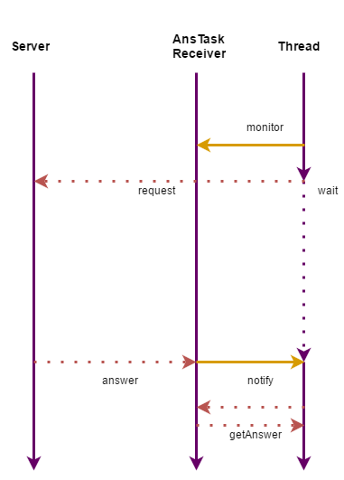

## Client Implementation description

The client's threads are represented at the image below:

 

The blocking method 'remoteCall' was implemented. It performs request to the server.
It can be called simultaneously from different threads. On the picture above 'Thread'
is one of such thread. To provide this feature another thread is launched - AnsTaskReceiver.
It accepts income results from the server and notify the thread that has sent
corresponding command. Here is a simple example of the workflow.

1)Before calling 'remoteCall' the thread creates an object-monitor and gives its 
reference to AnsTaskReceiver thread.
2)Then the thread initiate request sending. Since this moment the
result can come back to AnsTaskReceiver thread.
3)If there is no answer yet, the thread waits (monitor.wait())
4)When the result comes, AnsTaskReceiver notify the initial thread using 
monitor.nofify()
5)The initial thread takes the result from AnsTaskReceiver and returns it as 
as return value of the method.

